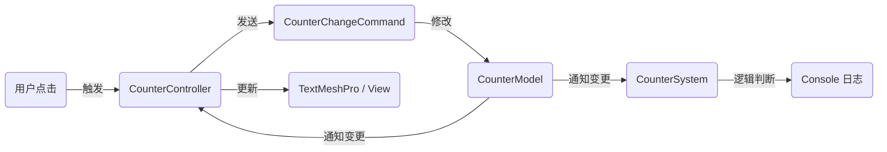

# Counter Demo

这个 Demo 展示了如何使用 **YFanFramework** (基于 QFramework) 构建一个标准的 MVC 交互功能。

它演示了以下核心架构概念：
1.  **Model (模型)**: 数据存储与响应式属性。
2.  **View/Controller (表现层)**: UI 绑定与事件监听。
3.  **Command (命令)**: 处理业务逻辑的触发。
4.  **System (系统)**: 处理无状态的业务逻辑监听。

## 架构数据流

---

## 代码详解

### 1. Model (数据层) - `CounterModel.cs`
负责存储数据。这里使用了 `BindableProperty`，使得数据变化时可以自动通知监听者。

*   **`[AutoRegister]`**: 自动注册到架构中，无需手动在 `YFanApp` 中注册。
*   **`BindableProperty<int>`**: 响应式数据容器，初始值为 0。

### 2. Controller (表现层) - `CounterController.cs`
挂载在 UI 物体上的脚本，负责 UI 绑定和用户交互。

*   **`[UIBind]`**: 自动查找场景中名为 `Txt_Counter` 的物体并获取 `TMP_Text` 组件。
*   **`[BindClick("Btn_Add")]`**: 自动将 `OnBtnAddClick` 方法绑定到名为 `Btn_Add` 的按钮点击事件上。
*   **`RegisterWithInitValue`**: 监听 Model 数据变化。
    *   *注意*: 使用 `WithInitValue` 确保了 UI 在初始化时立即显示 "0"，避免了第一次点击才刷新的问题。
*   **`SendCommand`**: 发送命令来修改数据，而不是在 View 层直接修改 Model（保持单向数据流）。

### 3. Command (命令层)
`CounterChangeCommand` 是一个纯 C# 类，用于封装"修改数值"这一行为。

*   **解耦**: View 层只管发送命令，不知道数据如何被修改。
*   **复用**: 这个命令可以在任何地方被发送（比如新手引导、网络消息）。

### 4. System (系统层) - `CounterSystem.cs`
负责监听数据变化并执行具体的业务逻辑（不涉及 UI）。

*   **逻辑**: 监听 Counter 的值。
*   **触发**: 当数值等于 **10** 时，打印一条日志。

---

## 在 Unity 中运行

按照以下步骤在 Unity 场景中搭建此 Demo：

### 第一步：准备场景
1.  新建一个 Scene。
2.  创建一个 **Canvas**。

### 第二步：创建 UI 元素
在 Canvas 下创建以下 UI 元素，并**确保命名一致**，如果命名不一致，需要在脚本中手动指定绑定的名称。

1.  **Text (TextMeshPro)**
    *   **命名**: `Txt_Counter`
    *   **作用**: 显示数字。
2.  **Button**
    *   **命名**: `Btn_Add`
    *   **作用**: 点击增加数字。

### 第三步：挂载脚本
1.  创建一个空物体或直接在 Canvas 的父节点上。
2.  挂载 `CounterController` 脚本。
3.  **注意**: 不需要手动拖拽赋值，`[UIBind]` 和 `[BindClick]` 会在运行时自动完成绑定。

### 第四步：运行测试
1.  点击 Play 运行游戏。
2.  点击 **Add** 按钮。
    *   👉 **预期**: `Txt_Counter` 的数字随点击增加。
    *   👉 **预期**: Console 控制台输出 "按钮 Btn_Add 被点击了"。
3.  连续点击直到数字变为 **10**。
    *   👉 **预期**: Console 控制台输出 `[CounterSystem] 计数器数值增加到：10`。

---

## 关键特性演示

| 特性 | 代码位置 | 说明 |
| :--- | :--- | :--- |
| **自动模块注册** | `[AutoRegister]` | Model 和 System 只要加上此标签，即可被架构自动扫描并托管。 |
| **UI 自动绑定** | `[UIBind]` | 省去了 `transform.Find("...").GetComponent<...>()` 的繁琐代码。 |
| **事件绑定** | `[BindClick]` | 省去了 `btn.onClick.AddListener(...)` 的样板代码。 |
| **数据驱动** | `BindableProperty` | 数据变化自动驱动 UI 更新，无需在点击事件里手动设置 Text。 |
| **命令模式** | `SendCommand` | 实现了逻辑与视图的分离。 |

---

## 常见问题

**Q: 点击按钮没有反应？**
*   **A1**: 检查场景中是否有名为 `EventSystem` 的物体。如果没有，UI 点击无法生效。
*   **A2**: 检查按钮命名是否严格确认为 `Btn_Add`。
*   **A3**: 检查 `Txt_Counter` 文本组件是否勾选了 `Raycast Target` 且遮挡住了按钮。

**Q: 为什么刚运行显示 "New Text" 而不是 "0"?**
*   **A**: 请确保在 `CounterController` 中使用的是 `RegisterWithInitValue` 而不是 `Register`。

---
