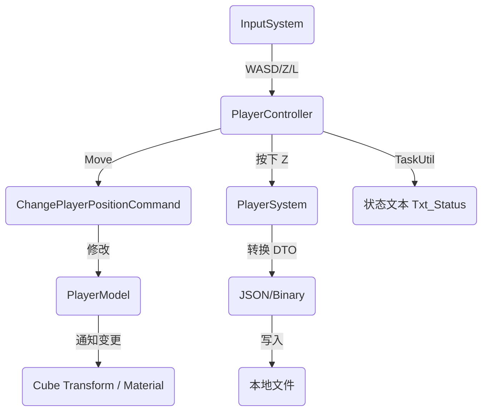

# Player Save & Async Demo

这个 Demo 展示了 **YFan Framework** 的进阶功能，重点演示了输入系统、数据持久化（存档）以及异步任务的协同工作。

它包含以下核心功能：
1.  **InputSystem (输入)**: 使用 Unity 新输入系统控制角色移动。
2.  **SaveUtil (存档)**: 将角色的位置和颜色保存到本地磁盘。
3.  **TaskUtil (异步)**: 使用 `UniTask` 处理异步 UI 提示（如"保存中..."的延迟效果）。
4.  **Safe Serialization (安全序列化)**: 演示如何避免 Unity 类型直接序列化导致的崩溃问题。

## 架构数据流

---

## 代码详解

### 1. Model (数据层) - `PlayerModel.cs`
定义角色的运行时数据。

*   **`PlayerSaveData` (DTO)**: **关键设计**。为了避免 Newtonsoft.Json 直接序列化 `Vector3` 或 `Color` 导致死循环（栈溢出崩溃），我们专门定义了一个纯数据类，使用 `List<float>` 来存储数值。
*   **`ToSaveData` / `FromSaveData`**: 负责在"运行时对象"和"存档数据"之间进行转换。

### 2. Controller (表现层) - `PlayerController.cs`
负责处理输入、更新视图以及调用异步 UI 任务。

*   **`[UIBind]`**: 自动绑定状态文本 `Txt_Status`。
*   **输入处理**: 在 `Update` 中通过 `_inputSystem` 获取输入，发送移动命令或执行存读档。
*   **异步 UI**: `ShowSaveStatusAsync` 使用 `async/await` 和 `TaskUtil.Delay`，优雅地实现了 UI 的延迟状态切换，替代了传统的 Coroutine。

### 3. Command (命令层)
`ChangePlayerPositionCommand` 负责处理具体的移动逻辑。

*   它获取 Model，根据输入计算新位置并赋值。
*   这保持了 Controller 的整洁，将计算逻辑剥离。

### 4. System (系统层) - `PlayerSystem.cs`
负责存档和读档的具体业务流程。

*   **`SaveGame`**: 获取 Model -> 转换为 DTO -> 调用 `SaveUtil.Save`。
*   **`LoadGame`**: 调用 `SaveUtil.Load` -> 恢复 Model 数据。

---

## 在 Unity 中运行

按照以下步骤在 Unity 场景中搭建此 Demo：

### 第一步：准备场景与物体
1.  **Player**: 创建一个 **Cube**，重置坐标为 (0,0,0)。
2.  **UI**: 创建一个 Canvas，添加一个 TextMeshPro，**命名为 `Txt_Status`**。
3.  **Controller**: 创建一个空物体命名为 `GameController`。

### 第二步：配置脚本
1.  选中 `GameController` 物体，挂载 `PlayerController` 脚本。
2.  **引用赋值**:
    *   将场景里的 **Cube** 拖拽赋值给脚本的 `Player Transform`。
    *   将 **Cube** 的 `Mesh Renderer` 组件拖拽赋值给脚本的 `Player Renderer`。
3.  **注意**: `Txt_Status` 不需要手动拖拽，框架会自动绑定。

### 第三步：输入配置 (InputSystem)
确保项目已正确配置 `InputSystem` 模块（参考框架配置）：
*   Action Map 名称: `Gameplay` (或默认配置)
*   Action `Move`: Vector2 类型 (WASD / 左摇杆)
*   Action `Save`: Button 类型 (键盘 Z)
*   Action `Load`: Button 类型 (键盘 L)

### 第四步：运行测试
1.  点击 Play 运行游戏。
2.  **移动**: 按 **W/A/S/D** 控制方块移动。
3.  **保存**: 按 **Z** 键。
    *   👉 **预期**: UI 显示绿色 "Saving..." -> "Save Successful!"。
    *   👉 **预期**: Console 显示 "游戏已保存"。
4.  **读取**: 移动方块到别处，然后按 **L** 键。
    *   👉 **预期**: 方块瞬间回到保存的位置。

---

## 关键特性演示

| 特性 | 代码位置 | 说明 |
| :--- | :--- | :--- |
| **DTO 模式** | `PlayerSaveData` | 使用数据传输对象 (Data Transfer Object) 隔离存档数据与运行时对象，防止序列化崩溃。 |
| **异步 UI** | `ShowSaveStatusAsync` | 使用 `TaskUtil` 处理延时逻辑，代码结构比协程更线性、更易读。 |
| **存档管理** | `SaveUtil.Save` | 封装了复杂的序列化与文件写入操作。 |
| **解耦输入** | `_inputSystem.GetVector2` | 业务逻辑不依赖具体的 `Input.GetKey`，方便后期改键或移植手柄。 |

---

## 常见问题

**Q: 按 Z 键后 Unity 编辑器直接崩溃/闪退？**
*   **A**: 这是因为尝试直接序列化 Unity 原生对象（如 `Vector3` 或 `Transform`）。请务必检查 `PlayerModel.cs`，确保使用了 `PlayerSaveData` 且内部使用 `List<float>` 存储数据，**严禁**在存档类中引用 `GameObject` 或 `Transform`。

**Q: 提示 "Txt_Status 未找到"？**
*   **A**: 请检查 Canvas 下的文本物体名称是否严格为 `Txt_Status`（区分大小写，无空格）。

**Q: 移动没反应？**
*   **A**: 请检查 InputSystem 是否初始化成功，以及 Input Actions 资源是否正确配置并加载。
